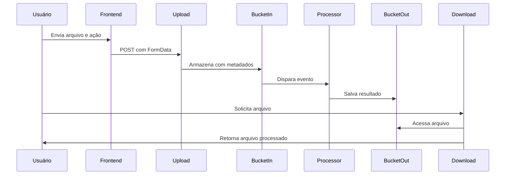

# Vision-GCloud: Plataforma de Processamento de Mídia Serverless


## 🌟 Visão Geral

O **Vision-GCloud** é uma solução completa de processamento de mídia construída na Google Cloud Platform, oferecendo:

- 🖼️ Processamento avançado de imagens
- 📄 Conversão de documentos
- ⚡ Arquitetura 100% serverless
- 🔒 Segurança de ponta a ponta
- 📈 Escalabilidade automática

**Casos de Uso Principais**:
- Fotógrafos que precisam processar imagens em lote
- Empresas que necessitam converter documentos em massa
- Aplicações web que demandam processamento de mídia

## 🏗️ Arquitetura Técnica

### Diagrama de Fluxo



### Componentes Principais

| Componente | Tecnologia | Descrição |
|------------|------------|-----------|
| **Frontend** | Firebase Hosting | Interface React responsiva |
| **Upload** | Cloud Run (Python) | Valida e armazena uploads |
| **Processador** | Cloud Run (Python) | Executa transformações |
| **Armazenamento** | Cloud Storage | Buckets privados para arquivos |
| **Download** | Cloud Run (Python) | Proxy seguro para downloads |

## 🛠️ Funcionalidades

### 🖼️ Processamento de Imagens

| Recurso | Descrição | Formatos Suportados |
|---------|-----------|---------------------|
| Filtros Artísticos | Sépia, Preto e Branco | JPG, PNG, WEBP, HEIC |
| Conversão | Entre formatos de imagem | JPG ↔ PNG ↔ WEBP |
| PDF | Criação a partir de imagens | JPG, PNG → PDF |

### 📄 Processamento de Documentos

| Recurso | Descrição | Formatos Suportados |
|---------|-----------|---------------------|
| Conversão | DOCX para PDF | DOCX → PDF |

## 🔒 Segurança e Limites

- **Autenticação**: Todos os endpoints exigem autenticação
- **Limites**:
  - Tamanho máximo por arquivo: 100MB
  - Tipos MIME validados
  - Rate limiting (100 requisições/minuto)
- **Privacidade**:
  - Arquivos temporários apagados após 24h
  - Dados nunca compartilhados com terceiros

## 🚀 Guia de Implementação

### Pré-requisitos

1. Conta Google Cloud com billing ativado
2. Ferramentas instaladas:
   ```bash
   gcloud components install beta
   npm install -g firebase-tools
   ```

### Configuração do Ambiente

```bash
# Clone o repositório
git clone https://github.com/seu-usuario/vision-gcloud.git
cd vision-gcloud

# Configure as variáveis de ambiente
cp .env.example .env
```

### Deploy da Infraestrutura

1. **Backend Services**:
   ```bash
   cd functions
   gcloud run deploy direct-upload-file \
     --source . \
     --set-env-vars=BUCKET_NAME=vision-gcloud-uploads
   ```

2. **Frontend**:
   ```bash
   cd ../frontend
   firebase deploy --only hosting
   ```

### Variáveis de Ambiente

| Variável | Obrigatória | Descrição |
|----------|-------------|-----------|
| `BUCKET_NAME` | Sim | Nome do bucket de upload |
| `DESTINATION_BUCKET` | Sim | Bucket para arquivos processados |
| `MAX_FILE_SIZE` | Não | Tamanho máximo em MB (padrão: 100) |

## 📊 Métricas e Monitoramento

A plataforma inclui:

- Dashboard no Cloud Monitoring com:
  - Latência por função
  - Taxa de erros
  - Uso de memória
- Alertas configurados para:
  - Erros 4xx/5xx
  - Tempo de processamento acima do esperado
  - Uso de armazenamento

## 🤝 Contribuição

1. Faça um fork do projeto
2. Crie sua branch (`git checkout -b feature/nova-funcionalidade`)
3. Commit suas mudanças (`git commit -m 'Adiciona nova funcionalidade'`)
4. Push para a branch (`git push origin feature/nova-funcionalidade`)
5. Abra um Pull Request

## 📄 Licença

Distribuído sob a licença MIT. Veja `LICENSE` para mais informações.

## ✉️ Contato

  
Projeto no GitHub - [github.com/seu-usuario/vision-gcloud](https://github.com/ianlucasalmeida/vision-gcloud)
